# Content OS: social content operations for Ceshker Group & NFAMation

A production dashboard that takes a real-estate law and title firm's content from a planning spreadsheet to published posts on **Facebook, Instagram and YouTube**. It covers planning, approval, Canva-generated graphics, automated brand checks, scheduling and live performance stats.

Built and run for a real client (Ceshker Group, Texas) as a full-stack TypeScript app on Railway.

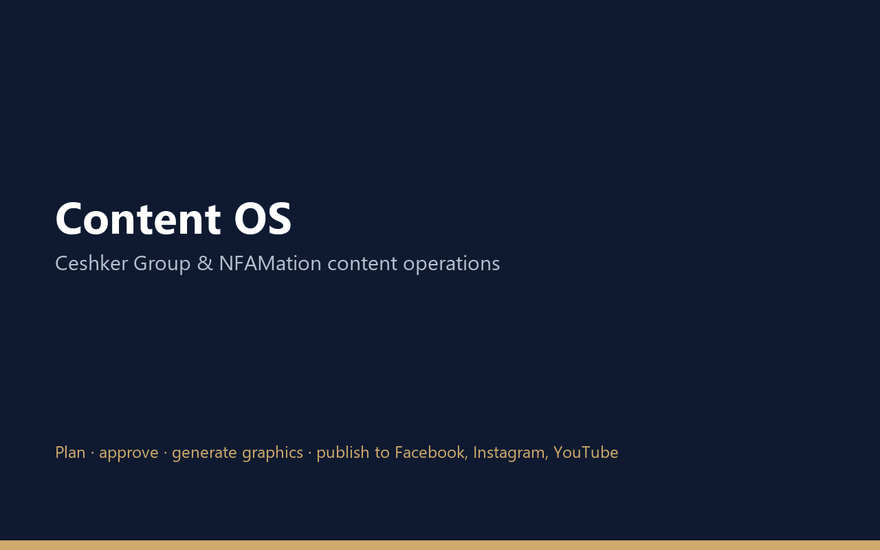

▶️ **[Watch the full walkthrough video (MP4, 40 s)](assets/content-os-walkthrough.mp4)**

▶️ **[Dashboard walkthrough, Sept 30 (MP4, 53 s)](docs/media/walkthrough-content-os.mp4)** · **[Short clip (MP4, 12 s)](docs/media/walkthrough-short.mp4)** · **[Earlier demo (MP4, 70 s)](docs/media/demo.mp4)**


---

## Ceshker Group postings: from a planning sheet to a daily feed

Alongside the dashboard, I run the client's actual social calendar. The brief from the account owner was simple: **at least one Ceshker post every day, birthdays and anniversaries first, and nothing that needs him in the loop to go out.** This section shows the posts, the design system behind them and the approval loop that keeps the client in control without slowing the feed down.

### Posts designed and shipped

| | | |
|---|---|---|
| 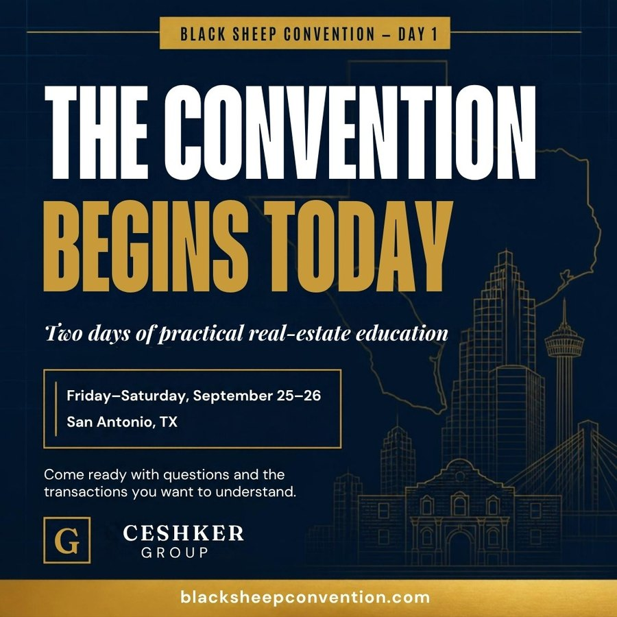 | 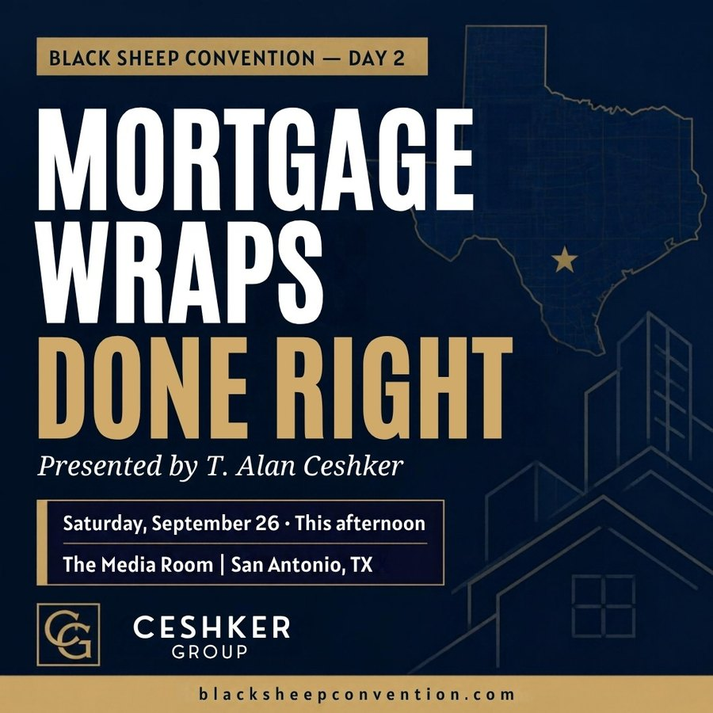 | 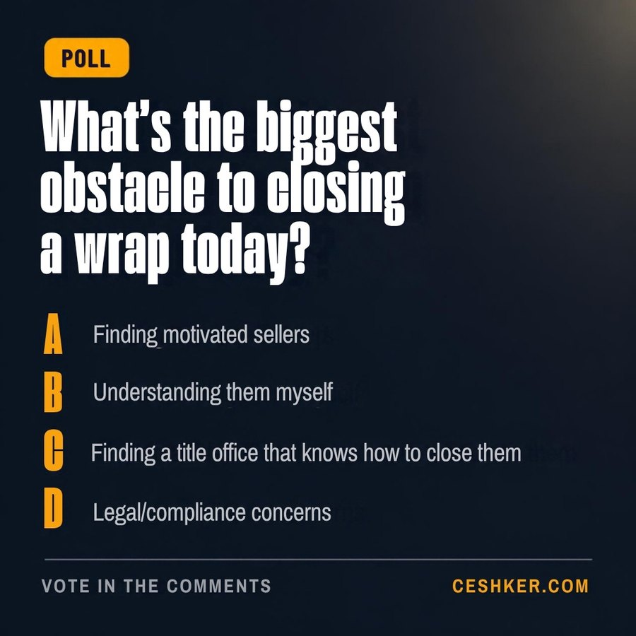 |
| Event day 1 · Sept 25 | Event day 2 · Sept 26 | Poll · Oct 7 |
| 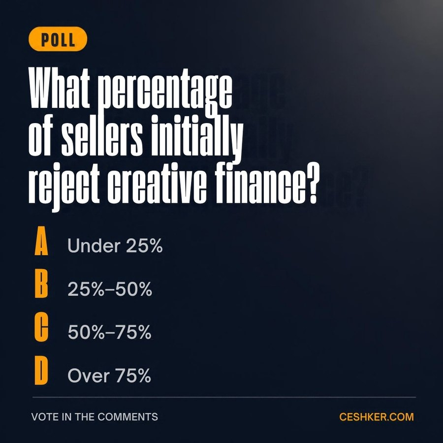 | 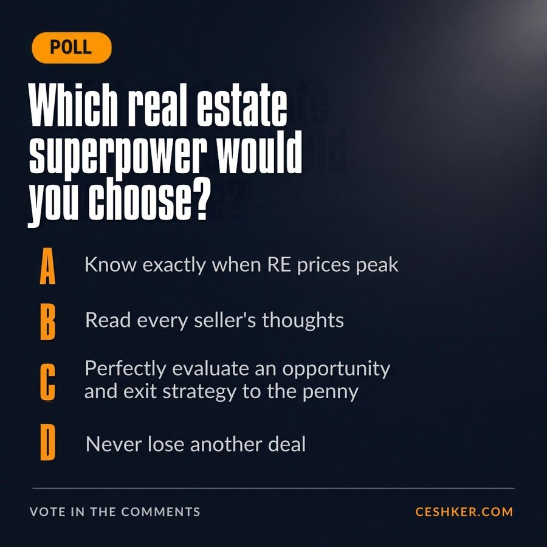 | 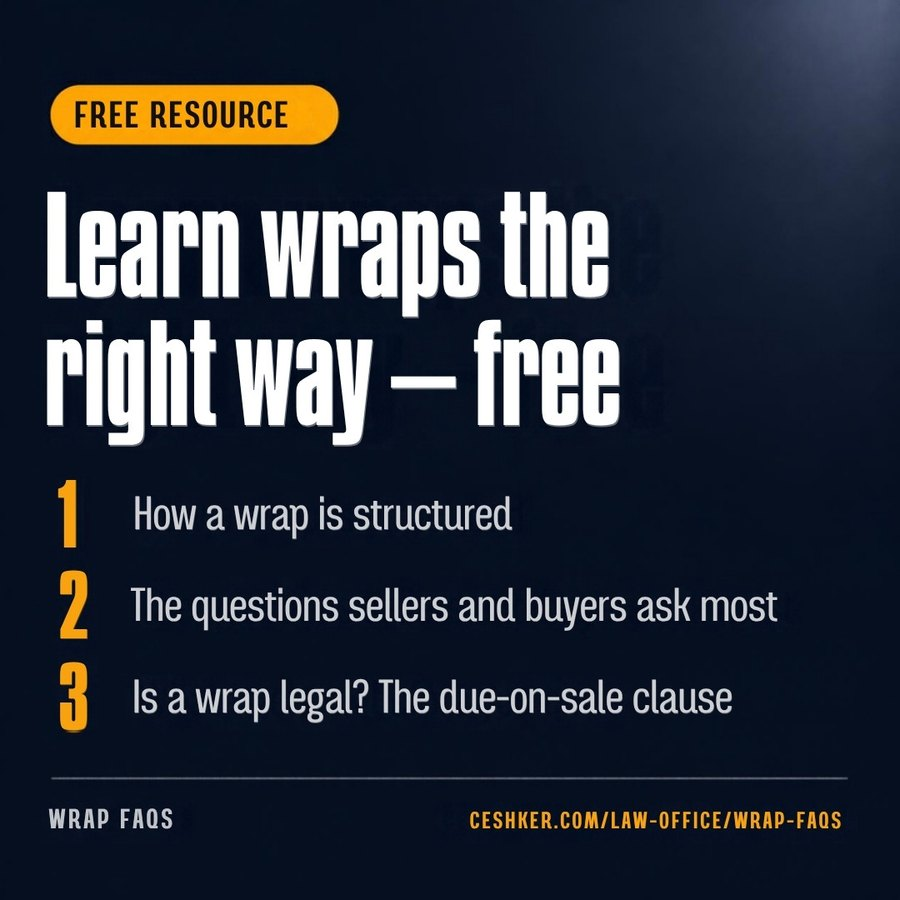 |
| Poll · Oct 9 | Poll · Oct 11 | Educational · Oct 12 |
| 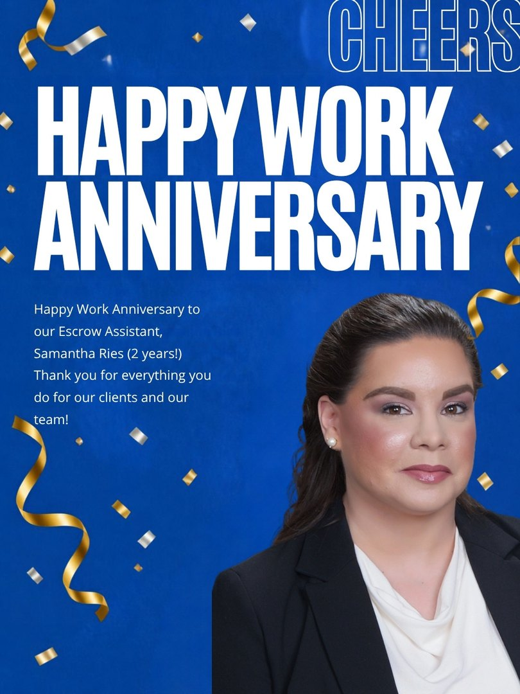 |  | 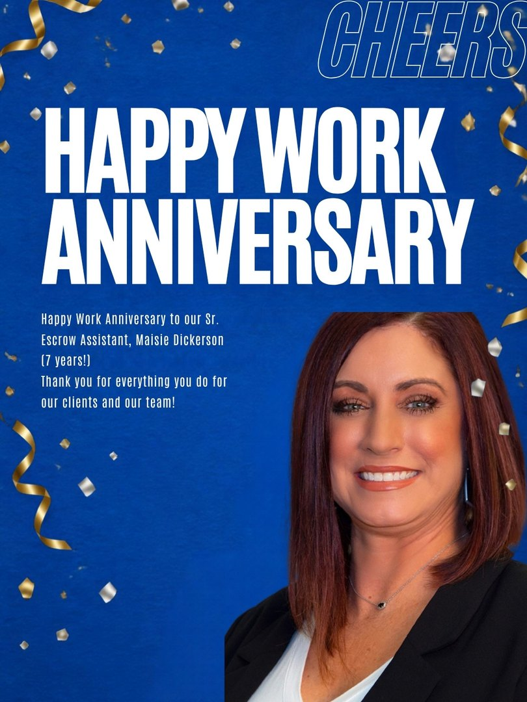 |
| Anniversary · Nov 11 | Birthday · Dec 1 | Anniversary · Dec 20 |

Three visual systems, each matched to how the brand already looks on Instagram rather than invented from scratch:

- **Event posts** use the brand kit: navy, gold, condensed uppercase type, the official logo and a Texas outline.
- **Educational posts and polls** copy the dark navy-to-charcoal look of the client's own NFAMation posts: an orange pill label, a heavy white headline, lettered options and the website in the footer.
- **Celebration posts** match the client's existing birthday and anniversary posts exactly: royal blue, confetti and ribbons, a huge white headline, the person's cut-out headshot. Headshots come from the company website, so a post is never blocked waiting for a photo.

### How a post gets made

1. **Plan.** The content calendar lives in a Google Sheet that the dashboard imports every 15 minutes. Birthdays and anniversaries come from a second sheet and are checked against the live Instagram feed first, because the team sometimes posts directly.
2. **Design.** Two paths. Routine posts are autofilled from Canva brand templates by the dashboard (headline, date, category) and attached as *not approved*. Anything more bespoke is built through Canva's API: upload the headshot, remove its background, generate the layout from a written brief that encodes the house style, swap the real photo in, fix the text, export.
3. **Approve.** The client gets one page with every pending post: graphic, caption, hashtags, date, platforms and a link to the editable design. Approve or request changes in one click. Decisions are stored in a shared database, so the page shows live status and I can read it back without a meeting.
4. **Publish.** Approved posts are queued in Content OS for 10:00 AM Central and go to the Facebook Page and @ceshkergroup on Instagram together. Anything not approved stays paused.

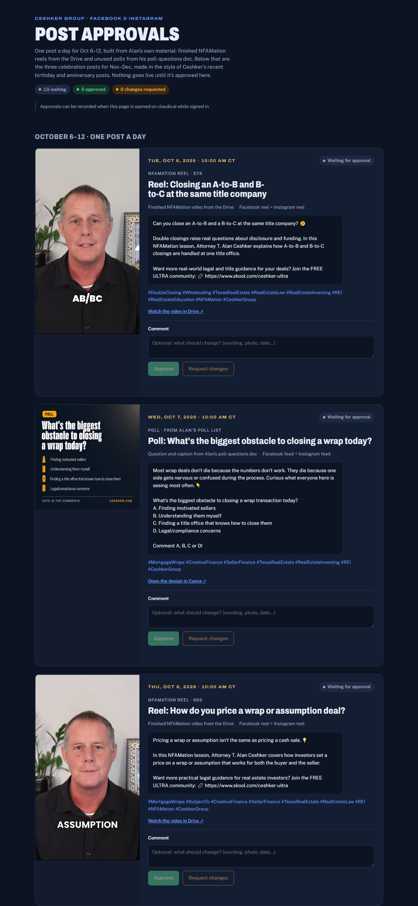

### Automation I added for this account

- **Canva design generation through the Canva connector**, including background removal, brand-kit colours and fonts, and element-level edits (text, position, opacity) to fix what the generator gets wrong.
- **A written house-style spec** per post type, so every new celebration or poll graphic comes out consistent without a template.
- **A client approval page** (HTML plus a small shared database) that replaces email back-and-forth. The client can approve from his phone; the approval history is kept.
- **Pause and resume per destination** in the dashboard, so a post can be held for Facebook, Instagram or both without deleting it.
- **Drive and sheet audits** before drafting: prepared graphics in the client's Drive, unused questions in the owner's poll document, finished reels in the video library, and the live feed, so nothing is repeated and nothing ready is wasted.

### Results

- Posting restarted the day the daily-output instruction came in, with the first post live on both platforms at the scheduled minute.
- A full week of October posts was drafted in one sitting from the client's own unused material (three finished reels, three polls, one resource post), with every graphic checked for spelling before it reached the client.
- The three celebration posts for November and December were designed, scheduled and then paused pending approval, with a reversible hold rather than a deletion.


---

## The problem

The client's marketing ran on a Google Sheet, a shared Drive of finished videos and manual posting:

- Posts went out late or not at all, with no record of who approved what.
- Graphics were made one by one, and AI design tools invented **fake company logos**.
- 50 finished educational videos (the *NFAMation* series) sat in Drive, unpublished on YouTube.
- Nobody could see, in one place, what was scheduled, what was blocked and how posts performed.

## What Content OS does

| Area | What it does |
|---|---|
| **Planning** | Imports the planning sheet every 15 minutes. Edits made in the dashboard are never overwritten by the next import. |
| **Approvals** | Each post shows a readiness checklist: title, caption, destinations, approved media, schedule and platform limits. Nothing publishes without approval, and any edit sends an approved post back to draft. |
| **Graphics** | One click fills a branded Canva template with the post's text and exports it. **Make all** handles every upcoming post, and an optional rule runs every 30 minutes. |
| **Brand checks (Canva MCP)** | Every generated graphic is inspected element by element. A graphic with a non-approved logo **cannot be approved**, and **Fix logo** swaps in the official logo automatically. |
| **Publishing** | Publishes directly through the Meta Graph API (Facebook + Instagram) and the YouTube Data API. A background dispatcher checks every 30 seconds. |
| **Video library** | Imports the NFAMation videos from Drive and manages YouTube titles, descriptions, playlists and private or scheduled uploads. |
| **Live stats** | Followers, views, likes and comments per platform, refreshed every minute. |
| **Audit trail** | Every change, approval, generation and publish is logged with who did it and when. |

## Screenshots

| | |
|---|---|
| 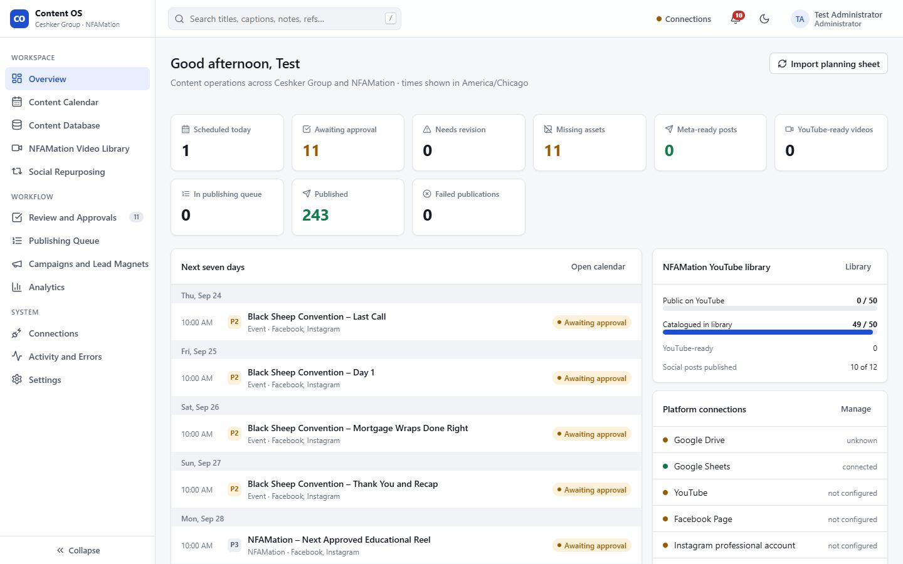 **Overview.** Today's schedule, the next 7 days, approvals and connection health. | 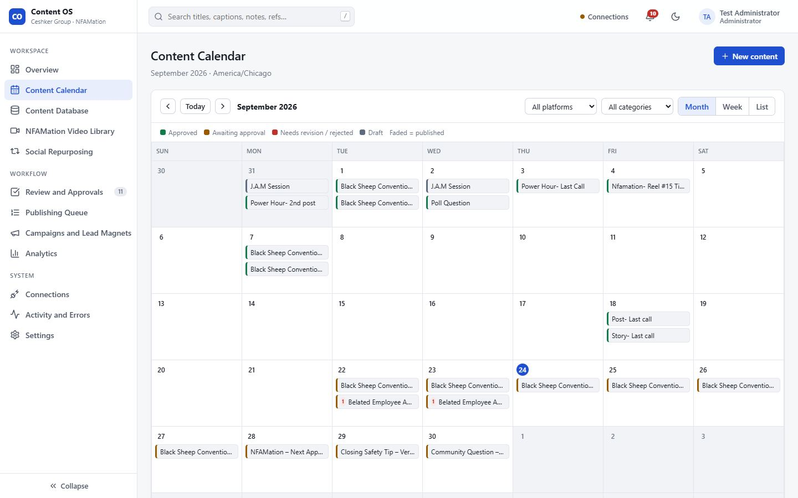 **Calendar.** Month, week and list views, colour-coded by approval. |
| 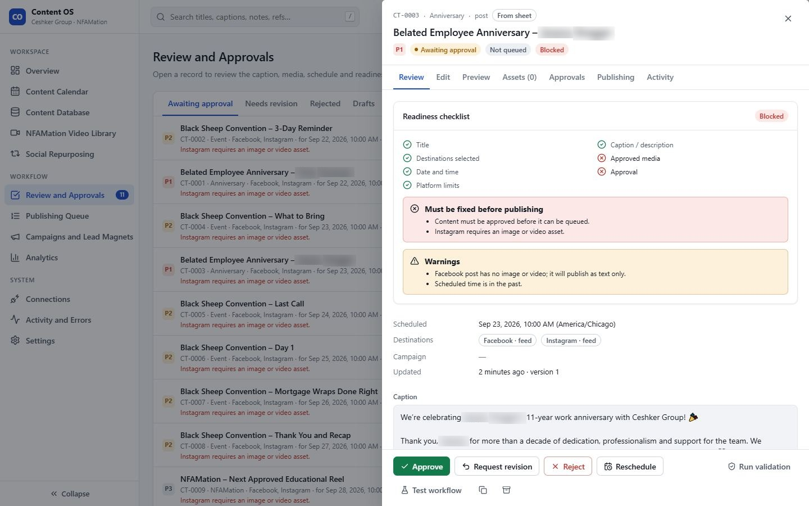 **Review.** The checklist names exactly what blocks a post. | 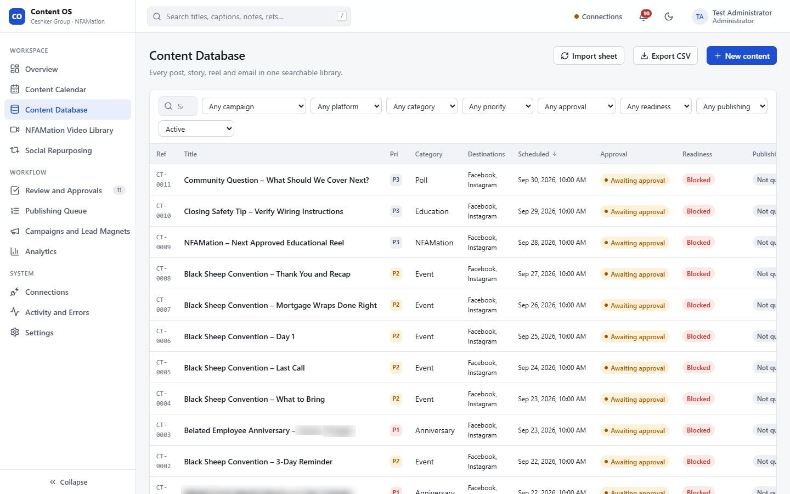 **Content database.** Search, filters, readiness, CSV export. |
| 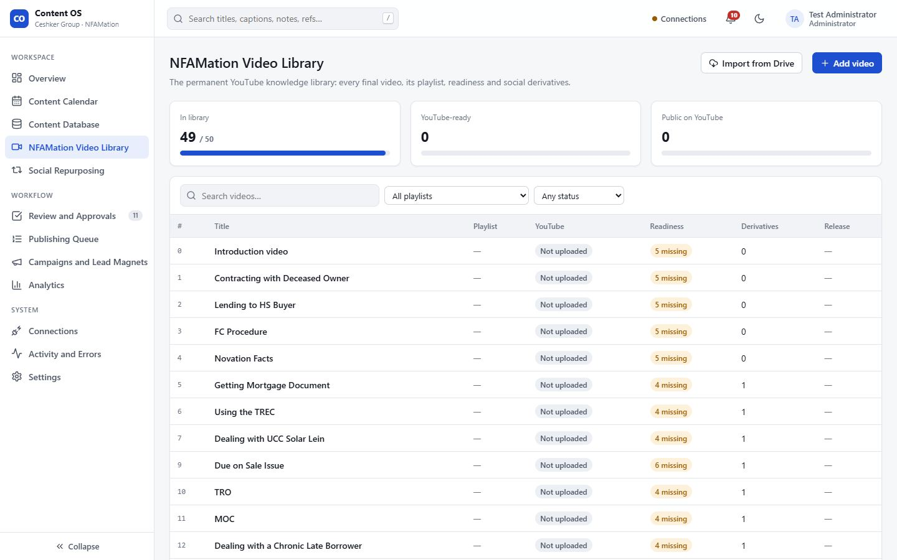 **Video library.** 49 of 50 videos catalogued from Drive. | 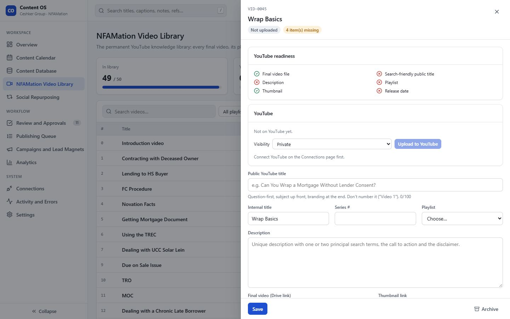 **YouTube drawer.** Title, playlist, release date, upload. |
| 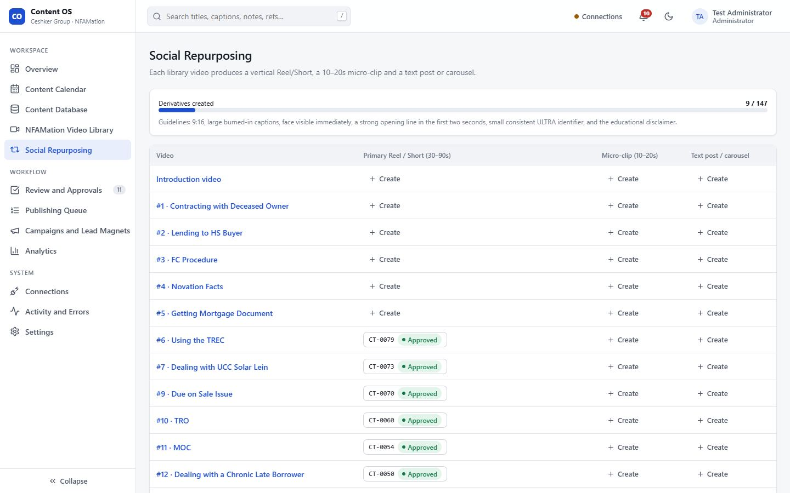 **Repurposing.** Reel, micro-clip and carousel drafts per video. | 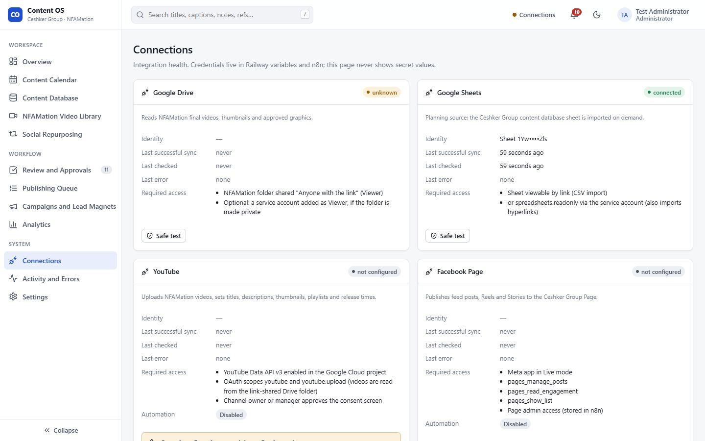 **Connections.** Safe tests and admin-only automation switches. |
| 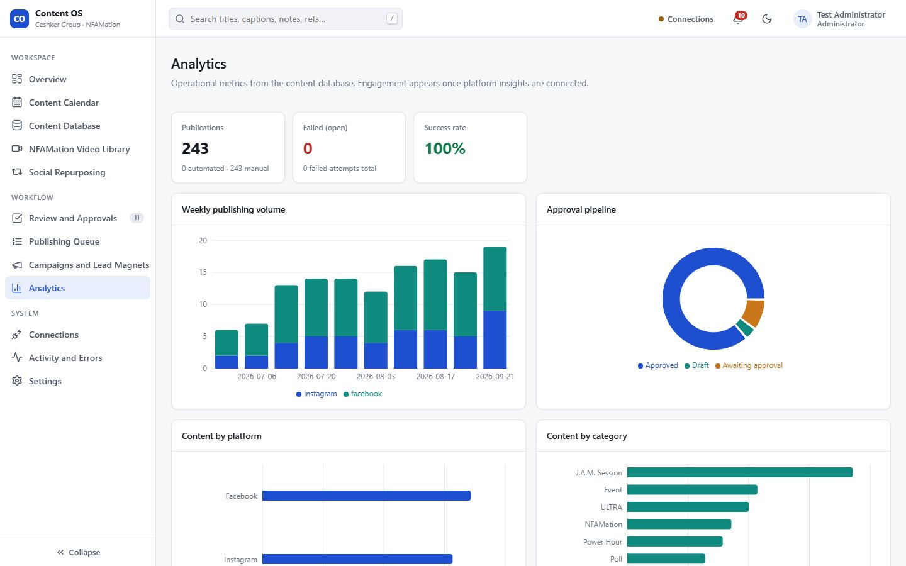 **Analytics.** Volume, approval pipeline, platform and category mix. | 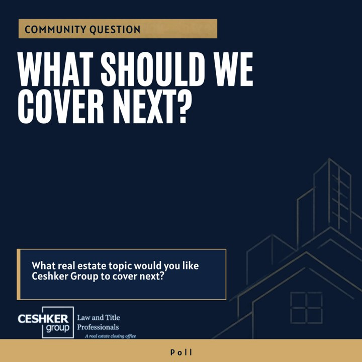 **Generated graphic.** Canva template filled automatically, with the approved logo. |

<sub>Screenshots come from the September 2026 build. The current version merges the calendar, approvals and queue into one Posts screen.</sub>

## Architecture

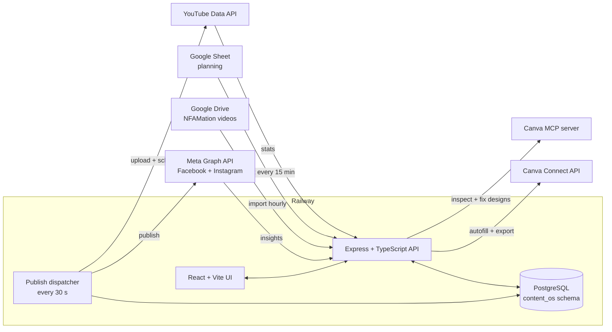
```mermaid
flowchart LR
  Sheet[Google Sheet<br/>planning] -->|import every 15 min| API
  Drive[Google Drive<br/>NFAMation videos] -->|import hourly| API
  subgraph Railway
    Web[React + Vite UI] <--> API[Express + TypeScript API]
    API <--> DB[(PostgreSQL<br/>content_os schema)]
    Disp[Publish dispatcher<br/>every 30 s] --> DB
  end
  API -->|autofill + export| Canva[Canva Connect API]
  API -->|inspect + fix designs| MCP[Canva MCP server]
  Disp -->|publish| Meta[Meta Graph API<br/>Facebook + Instagram]
  Disp -->|upload + schedule| YT[YouTube Data API]
  Meta -->|insights| API
  YT -->|stats| API
```

**Stack:** Node 22, Express, TypeScript, zod, React 18, Vite, TanStack Query, Recharts, PostgreSQL, sharp, Vitest. Deployed on Railway with a Dockerfile and a `/healthz` healthcheck.

## Engineering highlights

- **Safe publishing by default.** Text, image and destinations must all be approved before anything is queued. Retries reuse an idempotency key, so a post never goes out twice. A post that misses its slot by more than 2 hours fails rather than going out late.
- **Approval reset on change.** Optimistic locking with version numbers. Any substantive edit, or adding or removing media, returns an approved post to draft automatically.
- **Canva MCP brand guard.** Canva's REST API can fill templates but cannot see inside a design. Content OS also talks JSON-RPC to Canva's MCP server, opening an editing transaction to read every image element by its media ID:
  - a known fake logo fails the check and blocks approval;
  - the approved logo passes;
  - no logo is flagged for review, which is fine for celebration posts.

  **Fix logo** deletes the fake mark and the loose "Ceshker / Group" words beside it, inserts the official logo in the same space, commits, then re-exports a fresh image.
- **OAuth for a hosted MCP client.** Canva's MCP authorization server only redirects to known apps or loopback addresses. The dashboard registers itself with dynamic client registration, uses a PKCE loopback redirect, and finishes the token exchange server-side. It supports both of Canva's MCP tool sets (`read-design`/`edit-design` and the transaction-based tools).
- **Single-use refresh tokens.** Canva rotates refresh tokens on every use, so each refresh runs under a `SELECT … FOR UPDATE` row lock and saves the new token in the same transaction.
- **Secrets stay server-side.** OAuth tokens are AES-256-GCM encrypted at rest and never returned by the API. Automation switches are admin-only and need a recent successful connection test.
- **Multi-channel YouTube.** One-time connect links, valid for 24 hours, let a channel owner grant access without a dashboard login. Uploads can move to a new main channel without disturbing videos already scheduled on the old one.

## Results

| | |
|---|---|
| Content records managed | 118 imported from the planning sheet |
| NFAMation videos | 49 catalogued from Drive, 46 prepared with titles, descriptions and playlists, 25 scheduled on YouTube |
| Platforms connected | Facebook Page, Instagram business account, 2 YouTube channels, Canva |
| Brand checks | Fake logos caught on 3 older graphics; 1 fixed automatically in Canva |

## My role

Sole developer. I scoped the workflow with the client, then designed the data model and approval rules. I built the API, the UI and every integration: Google Sheets, Drive, Meta, YouTube, Canva Connect and Canva MCP. I deployed and operated the app on Railway, and wrote the user guide for the client's team.

## Running locally

```bash
cp .env.example .env      # DATABASE_URL, SESSION_SECRET, platform credentials
npm install
npm run migrate
npm run dev               # API on :8080, web on :5173
npm run test:server       # brand-check unit tests
```

---

<sub>Built for Ceshker Group. Credentials, IDs and private URLs are not included in this repository.</sub>
