# Content OS: social media command center

A production dashboard that runs a real estate education brand's whole content pipeline from one place. It covers planning, graphics, approvals, and publishing to Facebook, Instagram and YouTube, plus live performance numbers. It went live on Railway for a real client team and posts to their real channels.

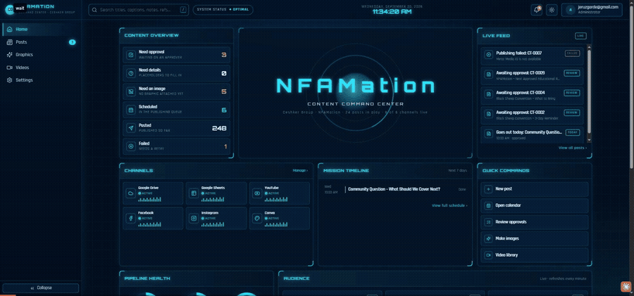

▶ **[Watch the full demo video (MP4, 70 s)](docs/media/demo.mp4)**

▶ **[Dashboard walkthrough, Sept 30 (MP4, 53 s)](docs/media/walkthrough-content-os.mp4)** · **[Short clip (MP4, 12 s)](docs/media/walkthrough-short.mp4)**

---

## Ceshker Group postings: from a planning sheet to a daily feed

Alongside the dashboard, I run the client's actual social calendar. The brief from the account owner was simple: **at least one Ceshker post every day, birthdays and anniversaries first, and nothing that needs him in the loop to go out.** This section shows the posts, the design system behind them and the approval loop that keeps the client in control without slowing the feed down.

### Posts designed and shipped

| | | |
|---|---|---|
|  |  |  |
| Event day 1 · Sept 25 | Event day 2 · Sept 26 | Poll · Oct 7 |
|  |  |  |
| Poll · Oct 9 | Poll · Oct 11 | Educational · Oct 12 |
|  |  |  |
| Anniversary · Nov 11 | Birthday · Dec 1 | Anniversary · Dec 20 |

Three visual systems, each matched to how the brand already looks on Instagram rather than invented from scratch:

- **Event posts** use the brand kit: navy, gold, condensed uppercase type, the official logo and a Texas outline.
- **Educational posts and polls** copy the dark navy-to-charcoal look of the client's own NFAMation posts: an orange pill label, a heavy white headline, lettered options and the website in the footer.
- **Celebration posts** match the client's existing birthday and anniversary posts exactly: royal blue, confetti and ribbons, a huge white headline, the person's cut-out headshot. Headshots come from the company website, so a post is never blocked waiting for a photo.

### How a post gets made

1. **Plan.** The content calendar lives in a Google Sheet that the dashboard imports every 15 minutes. Birthdays and anniversaries come from a second sheet and are checked against the live Instagram feed first, because the team sometimes posts directly.
2. **Design.** Two paths. Routine posts are autofilled from Canva brand templates by the dashboard (headline, date, category) and attached as *not approved*. Anything more bespoke is built through Canva's API: upload the headshot, remove its background, generate the layout from a written brief that encodes the house style, swap the real photo in, fix the text, export.
3. **Approve.** The client gets one page with every pending post: graphic, caption, hashtags, date, platforms and a link to the editable design. Approve or request changes in one click. Decisions are stored in a shared database, so the page shows live status and I can read it back without a meeting.
4. **Publish.** Approved posts are queued in Content OS for 10:00 AM Central and go to the Facebook Page and @ceshkergroup on Instagram together. Anything not approved stays paused.


### Automation I added for this account

- **Canva design generation through the Canva connector**, including background removal, brand-kit colours and fonts, and element-level edits (text, position, opacity) to fix what the generator gets wrong.
- **A written house-style spec** per post type, so every new celebration or poll graphic comes out consistent without a template.
- **A client approval page** (HTML plus a small shared database) that replaces email back-and-forth. The client can approve from his phone; the approval history is kept.
- **Pause and resume per destination** in the dashboard, so a post can be held for Facebook, Instagram or both without deleting it.
- **Drive and sheet audits** before drafting: prepared graphics in the client's Drive, unused questions in the owner's poll document, finished reels in the video library, and the live feed, so nothing is repeated and nothing ready is wasted.

### Results

- Posting restarted the day the daily-output instruction came in, with the first post live on both platforms at the scheduled minute.
- A full week of October posts was drafted in one sitting from the client's own unused material (three finished reels, three polls, one resource post), with every graphic checked for spelling before it reached the client.
- The three celebration posts for November and December were designed, scheduled and then paused pending approval, with a reversible hold rather than a deletion.


---

## The problem

The team planned posts in a Google Sheet, made graphics by hand in Canva, and uploaded videos to YouTube one at a time. Every post went up manually, platform by platform. Nobody could see at a glance what was scheduled, what was waiting for approval, or what had failed.

## What Content OS does

| Area | What it does |
|---|---|
| **Home** | Live command center: posts waiting for approval, what's scheduled today, recent activity, and connection health for each channel. |
| **Live performance** | Views, likes, comments and reach for Facebook, Instagram and YouTube. Refreshes every 60 seconds with a server-side cache so the platform APIs are never hammered. |
| **Posts** | Every planned post, synced in automatically from the planning sheet. Quick filters: *Upcoming, Needs approval, Needs an image, Scheduled, Posted, Failed*. Missed posts are flagged automatically. List and calendar views. |
| **Post details** | One panel with three tabs: *Post* (caption, date, destinations), *Image* (upload or generate in Canva) and *Approve & publish* (a readiness checklist, per-platform status, retry). |
| **Graphics** | Automatic Canva graphics. The right brand template is picked from the post's topic and autofilled with the headline, date and category. The image is exported, downscaled and attached as *not approved* until a person checks it. One click makes every missing image, or turn on automatic mode. |
| **Videos** | A library of about 50 YouTube videos: upload, titles, descriptions, playlists, release dates, privacy, and duplicate merging. Supports several connected channels with a *main channel* handover. |
| **Connections** | Health cards for YouTube, Facebook Pages, Instagram, Canva, Google Sheets, Drive and Postgres. Each one has a **Safe test** that checks the connection without publishing anything. |
| **One-time connect links** | Channel owners connect their YouTube account from a single-use, 24-hour link. They never need a dashboard login and never share a password. |
| **Team & audit log** | Role-based access (administrator, content manager, approver, viewer). Every action is written to an audit log: who did it, what changed, and the result. |

## Screenshots

| | |
|---|---|
|  **Home command center** | 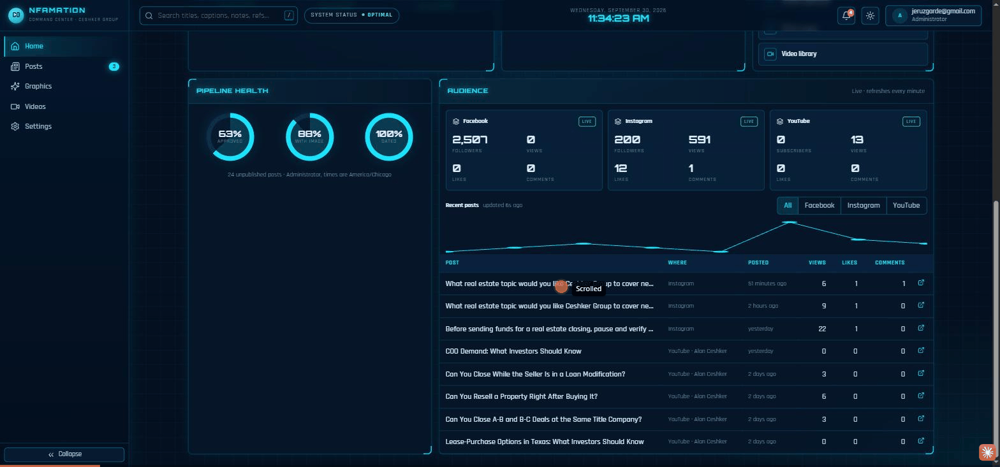 **Live performance per platform** |
| 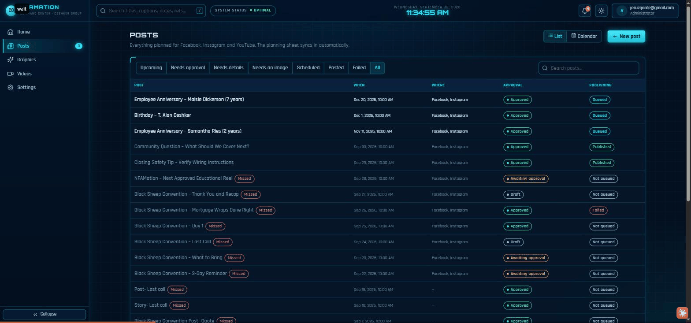 **Posts list with quick filters** | 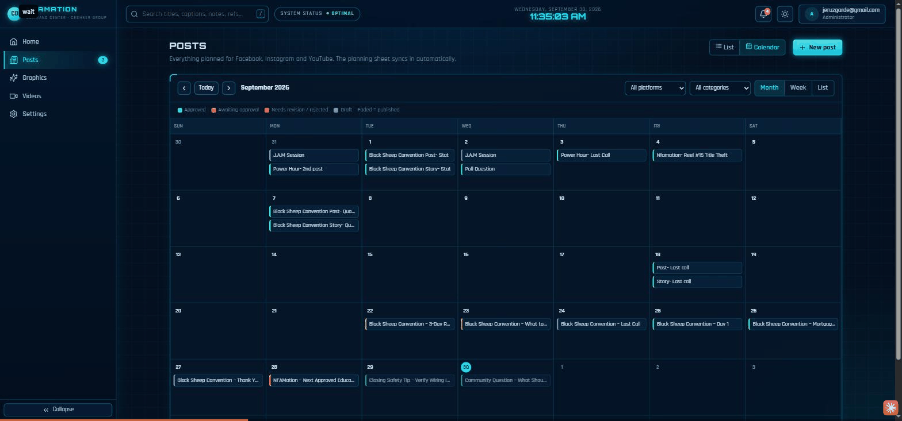 **Calendar view** |
| 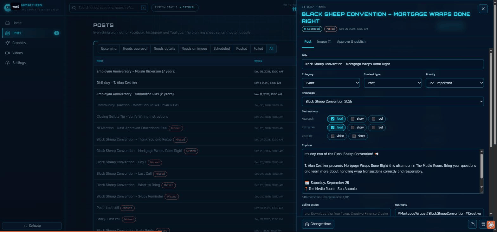 **Post editor** | 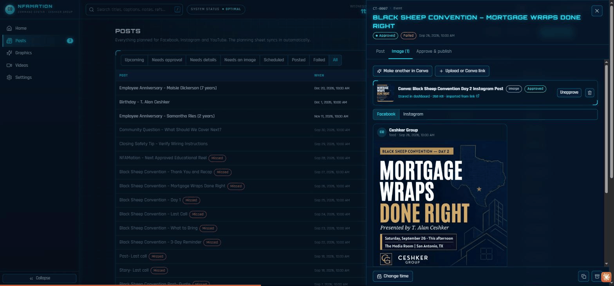 **Canva-generated post image** |
| 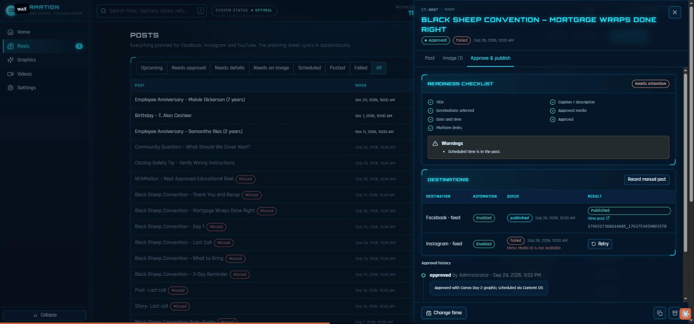 **Readiness checklist, approve & publish** | 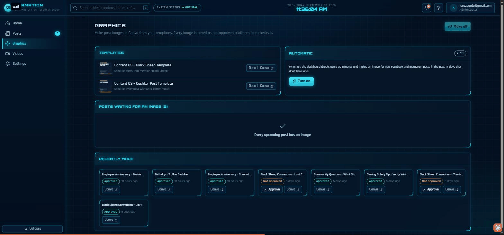 **Graphics: templates and automation** |
| 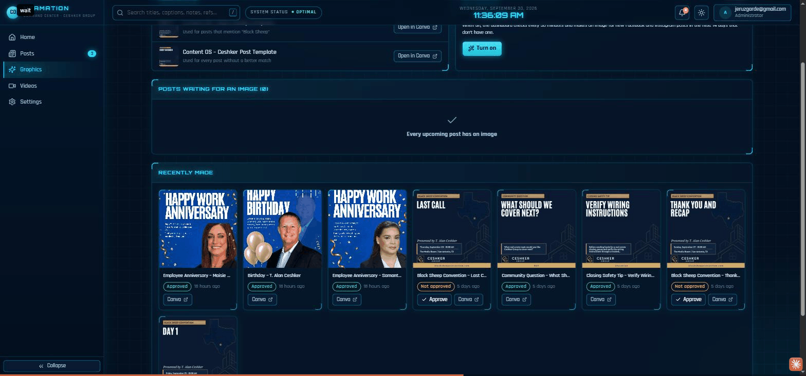 **Recently generated graphics** | 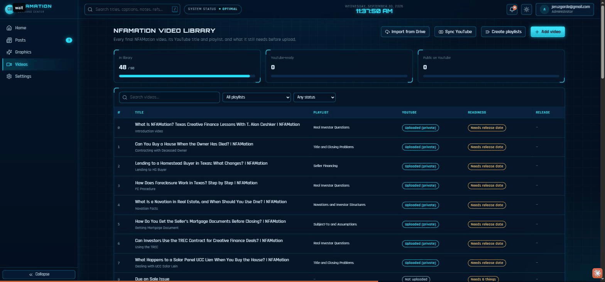 **YouTube video library** |
| 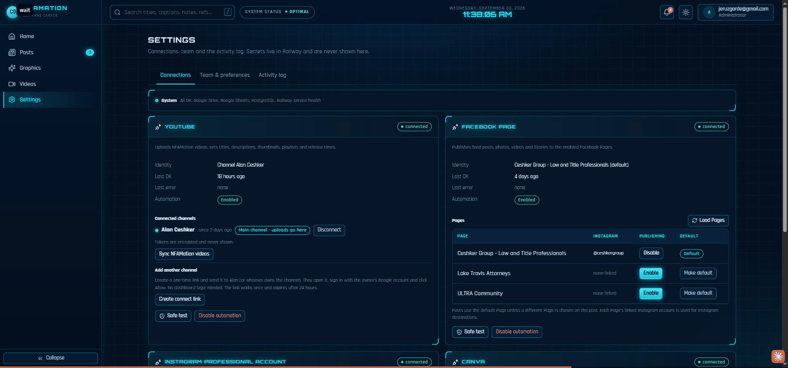 **Connections and safe tests** | 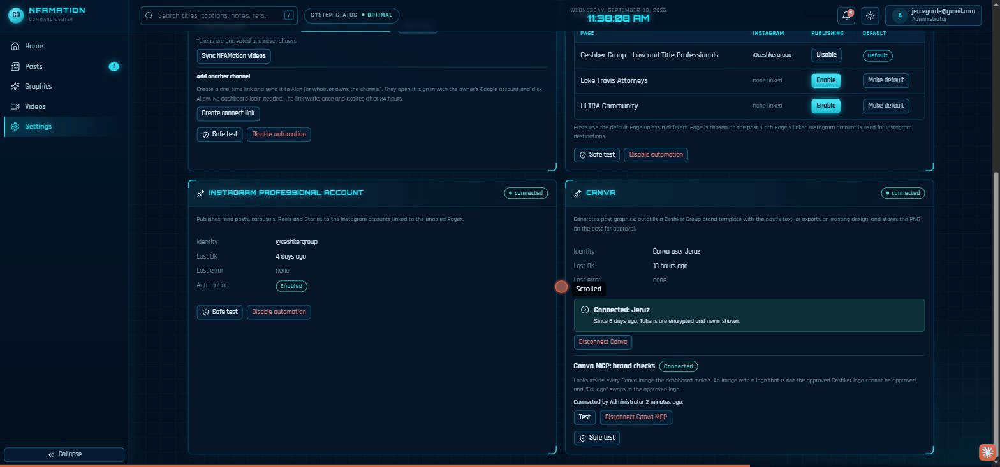 **Instagram and Canva connections** |
| 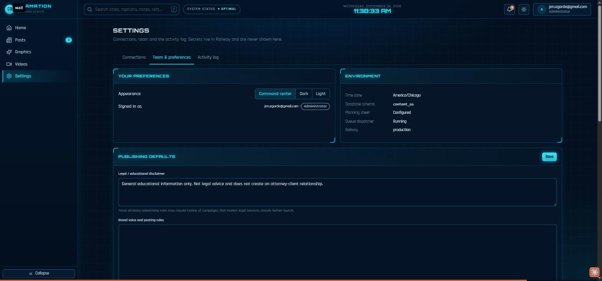 **Team and preferences** | 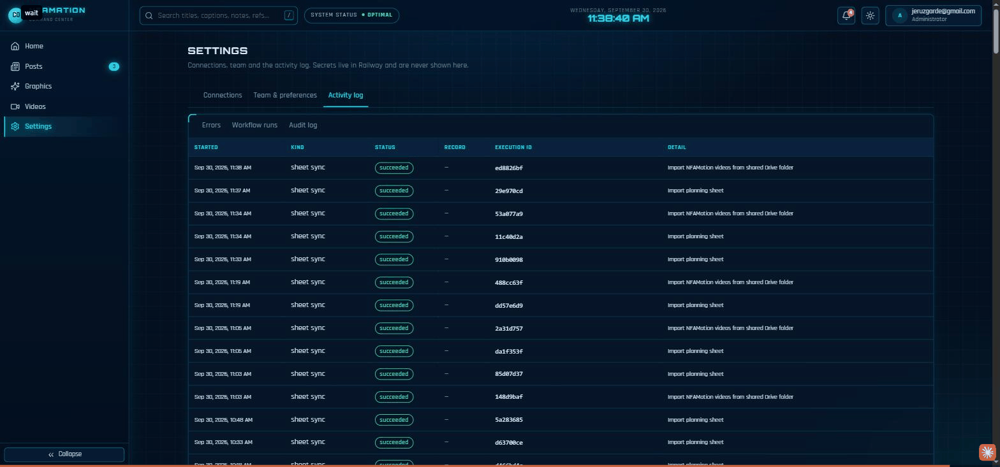 **Audit log** |

## Architecture

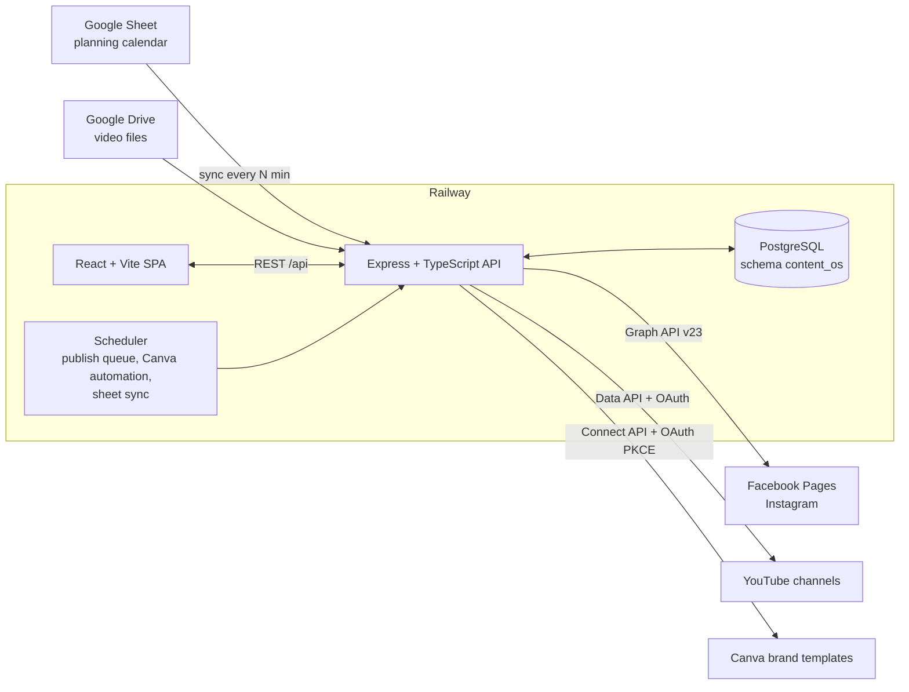

**Publishing flow:** sheet row → post (draft) → image (Canva, auto or manual) → human approval → queued → published to each platform → status and link written back, with retries and a full audit trail.

## Tech stack

- **Frontend:** React 18, Vite, TypeScript, TanStack Query, React Router, lucide icons. Custom "command center" dark theme plus light and dark modes. Responsive, keyboard accessible (`/` or `Ctrl+K` search).
- **Backend:** Node 22, Express, TypeScript (NodeNext ESM), zod validation on every input, helmet, cookie sessions with bcrypt.
- **Database:** PostgreSQL in its own schema, with forward-only SQL migrations (`server/db/migrations`).
- **Integrations:** Meta Graph API (Page and Instagram publishing, insights), YouTube Data API (resumable uploads, playlists, scheduling), Canva Connect API (OAuth PKCE, autofill, export), and the Google Sheets and Drive APIs.
- **Image pipeline:** `sharp` downscales Canva exports to 1440 px JPEG before storage.
- **Hosting:** Railway (Dockerfile build, health checks).

## Engineering highlights

- **Safe by default.** Nothing publishes without human approval. Generated images always start as *not approved*. Connection tests never post.
- **Encrypted tokens at rest.** OAuth tokens are sealed with a secretbox (`server/services/secretbox.ts`) and never sent to the browser.
- **Single-use refresh tokens handled correctly.** Canva rotates refresh tokens on every use, so refreshes run inside a `SELECT … FOR UPDATE` row lock to avoid races between workers.
- **Instagram container polling.** Publishing waits for the media container to finish and retries on the "media not ready" error codes instead of failing.
- **Multi-channel YouTube handover.** When the owner connects the new main channel, library links move to it automatically and the old records are kept as copies.
- **Sheet is a source, not the database.** Sheet rows are imported idempotently, and edits made in the dashboard are never overwritten by a later sync.
- **Hashed one-time invite links.** Only a hash of each token is stored. Links expire, can be revoked, and are single use.
- **Cached live metrics.** `/api/performance` is cached for 60 seconds so a room full of open dashboards costs one set of API calls.

## Project structure

```
server/
  routes.ts            REST API (auth, content, approvals, publishing, videos, Canva, OAuth)
  services/            meta.ts, youtube.ts, canva.ts, googleOAuth.ts, sheetSync.ts, queue.ts, ...
  db/migrations/       001_init … 009_canva_mcp (forward-only SQL)
  scripts/             bootstrap, seed, verification scripts
shared/                domain types and time helpers used by both sides
web/src/
  pages/               Overview, ContentDatabase, Calendar, Graphics, VideoLibrary, SettingsHub, ...
  components/          Layout, ContentDrawer, ContentForm, ui kit
scripts/               end-to-end and integration checks (e2e.mjs, connect-link-check.mts, ...)
docs/media/            demo video, GIF and screenshots
```

## Running it

```bash
cp .env.example .env        # fill in DATABASE_URL, SESSION_SECRET, ADMIN_EMAIL/PASSWORD
npm install
npm run migrate
npm run seed                # first admin + sheet import
npm run dev                 # API :8080, web :5173
```

Production: `npm run build && npm start`, or deploy the Dockerfile to Railway. Each integration (Meta, Google OAuth, Canva) turns on when its environment variables are set. Until then its card on the Connections page shows what's missing.

### Tests and checks

- `npm test` and `npm run test:server`: unit tests (Vitest)
- `node scripts/e2e.mjs`: end-to-end API checks against a running instance
- `npx tsx server/scripts/verify-canva.ts`: 21 checks against a mocked Canva API
- `npx tsx scripts/connect-link-check.mts`: 9 checks for one-time connect links

## Notes

The client's data (planning sheet contents, content plans, video files, tokens) is not included. The `data/` files are empty placeholders and `.env.example` holds placeholder values. Brand names, employee names and photos, and the graphics shown belong to the client and are included for portfolio purposes only. The screen recordings show the dashboard with the client's planning data.
